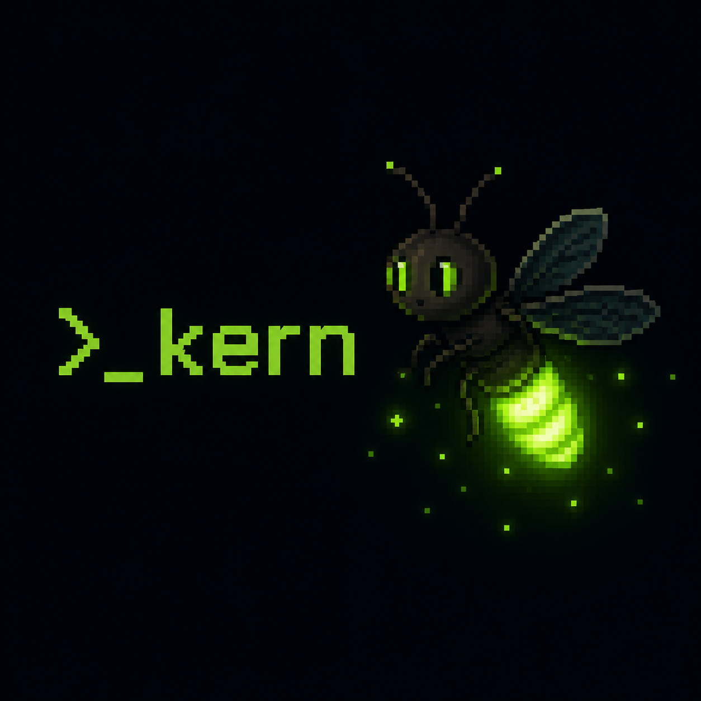
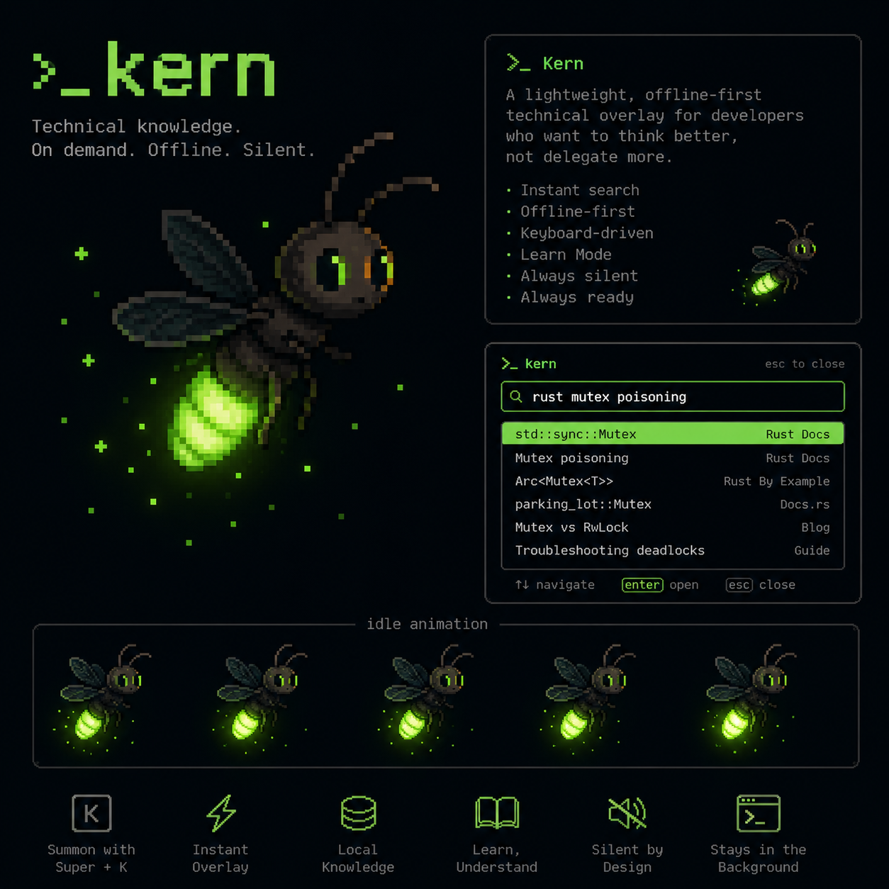

# >_ kern

<p align="center">
  
</p>

<p align="center">
  <strong>Technical knowledge. On demand. Offline. Silent.</strong>
</p>

<p align="center">
  A lightweight, offline-first technical overlay for developers who want to think better, not delegate more.
</p>

## What is Kern?

Kern is a resident overlay for Linux developers.

You press `Super + K`. A panel appears. You search. You find what you need. You press `ESC`. It disappears. You keep working.

That is the entire interaction model.

Kern does not write code for you. It does not autocomplete your thoughts. It does not replace understanding with convenience. It gives you fast access to technical knowledge, documentation, commands, troubleshooting, and gets out of your way.

## Why Kern exists

Most developer tools optimise for output. They generate, suggest, complete, and decide.

Kern optimises for understanding.

Kern was built where offline-first is not a design choice, it is a daily reality. That constraint shaped every decision: a lightweight daemon, local indexing, zero network dependency.

The habit of reaching for an AI to answer every technical question is slowly eroding something important: the ability to reason through a problem independently. To read documentation. To trace an error. To understand what you are building and why.

Kern was built as a counter to that habit. Not as a rejection of technology, but as a deliberate choice to keep the programmer in control of their own thinking.

## Features

- **Instant search**, full-text search across local documentation, commands, and guides
- **Offline-first**, everything lives locally, no internet required
- **Keyboard-driven**, `Super + K` to open, `ESC` to close, arrows to navigate
- **Silent by design**, resident in the background, invisible until needed
- **Minimal footprint**, near-zero CPU and RAM usage at idle
- **Learn Mode** *(planned)*, hints and architecture guidance instead of generated answers
- **Workspace detection** *(planned)*, adapts to your current project's stack

## Stack

| Layer | Technology | Reason |
|---|---|---|
| Core | Rust | Performance, low memory, safe concurrency |
| UI | Tauri + Svelte | Native Linux, lightweight, no Electron overhead |
| Search | Tantivy | Local full-text and fuzzy search in Rust |
| Docs | Markdown | Portable, fast to index, easy to render |

## Architecture

Kern is divided into three components:

**Daemon**, resident background process. Handles hotkeys, indexing, caching, and IPC. Starts at boot and stays invisible.

**Engine**, the knowledge core. Responsible for parsing Markdown documents, building the Tantivy index, and serving search results.

**Overlay**, the visual layer. Built with Tauri and Svelte. Appears on `Super + K`, disappears on `ESC`. Keyboard-first, minimal, fast.

<p align="center">
  
</p>

## Status

Kern is in active early development. The core search pipeline is functional, the daemon indexes local Markdown documents and serves results to the overlay via HTTP. The overlay renders results in real time.

What works today:
- Daemon starts and indexes docs automatically
- Full-text search via Tantivy
- Overlay connected to daemon via HTTP
- Results rendered in real time
- `ESC` clears the search

What is being built:
- Native `Super + K` global hotkey
- Tauri native window replacing browser preview
- Richer result cards with excerpts and source paths
- Package distribution for major Linux distros

## Roadmap

| Phase | Description | Status |
|---|---|---|
| 1 — Foundation | Daemon, engine, overlay connected end-to-end | ✅ Done |
| 2 — Native | Global hotkey, Tauri window, result navigation | 🔧 In progress |
| 3 — Content | Documentation library, command reference, troubleshooting guides | ⏳ Planned |
| 4 — Learn Mode | Hint mode, architect mode, workspace detection | ⏳ Planned |
| 5 — Distribution | AUR, Debian package, Flatpak, AppImage | ⏳ Planned |

## Getting started

### Requirements

- Linux (X11 or Wayland)
- Rust 1.77+
- Node.js 20+
- WebKit2GTK 4.1

### Build from source

```bash
git clone https://github.com/ylite4taty/Kern.git
cd kern
cargo build --release
```

### Run the daemon

```bash
RUST_LOG=info cargo run -p kern-daemon
```

### Run the overlay (development)

```bash
cd overlay
npm install
npm run dev
```

## Philosophy

Kern is not another AI tool.

It is a tool for developers who have noticed what happens when you stop thinking for yourself. Who have felt the difference between understanding a solution and copying one. Who want to rebuild the habit of reading, reasoning, and learning.

The firefly does not illuminate everything. It shows you just enough to take the next step.

That is what Kern is for.

## Contributing

Kern is open source and welcomes contributions. See [CONTRIBUTING.md](CONTRIBUTING.md) for guidelines.

## License

MIT